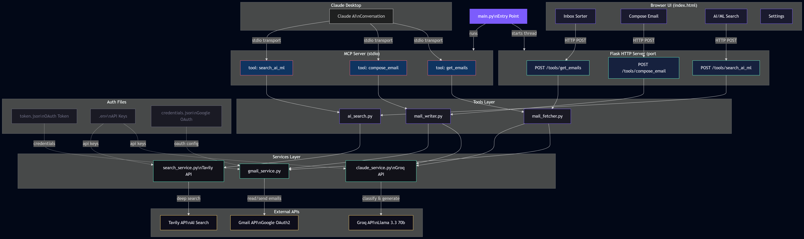

<div align="center">

<br/>


<br/><br/>

**An intelligent developer productivity platform powered by AI.**<br/>
Manage email, analyse GitHub repositories, and tailor resumes — all from a single local server.

<br/>

[](https://python.org)
[](https://flask.palletsprojects.com)
[](https://docs.pylonsproject.org/projects/waitress)
[](https://console.groq.com)
[](https://github.com/jlowin/fastmcp)
[](https://github.com/rayyan666/MAIL-MCP/actions/workflows/ci.yml)
[](LICENSE)

<br/>

</div>

---

## Overview

Hermes is a dual-interface AI productivity server that runs entirely on your local machine. It exposes five AI-powered tools through two interfaces simultaneously — a **Model Context Protocol (MCP) server** for Claude Desktop, and a **Flask HTTP API** backing a built-in web UI.

The server is powered by **Groq** (`llama-3.3-70b-versatile`) for all AI tasks, with **Waitress** (Windows) or **Gunicorn** (Linux/macOS) as the production WSGI layer — auto-selected at runtime with zero configuration.

No data leaves your machine except for API calls to Gmail, GitHub, Groq, and arXiv/HuggingFace/PapersWithCode.

---

## Capabilities

| Module | Description |
|---|---|
| **Inbox Sorter** | Fetches Gmail and classifies every message by priority — critical, high, medium, or low — using AI analysis of subject, sender, and content. |
| **Email Composer** | Generates professional emails via Groq with configurable tone. Supports one-click send via Gmail API. |
| **AI/ML Search** | Deep research across arXiv, HuggingFace, and PapersWithCode. Returns ranked papers, models, and structured insights. |
| **GitHub Analyzer** | Full portfolio analysis across 8 actions: repo overview, commit activity, README quality scoring, stale repo detection, AI code review, tech stack mapping, and dependency auditing. |
| **Resume Tailor** | Two-phase AI tailoring — JD analysis followed by resume rewriting with match scoring, gap analysis, and interview tips. |

---

## Architecture



> Full data flow from Claude Desktop and Browser UI through the MCP/HTTP layers, tools, services, and external APIs.

---

## Project Structure

```
hermes/
├── main.py                        # Flask app + MCP server (WSGI entry point)
├── serve.py                       # Smart launcher — auto-detects OS and WSGI server
├── gunicorn.conf.py               # Gunicorn configuration (Linux/macOS)
├── logger.py                      # Structured logging
├── check_groq.py                  # API key diagnostic utility
│
├── tools/
│   ├── mail_fetcher.py            # Gmail fetch + Groq classification
│   ├── mail_writer.py             # Email generation + Gmail send
│   ├── ai_search.py               # Multi-source AI/ML research
│   ├── github_analyzer.py         # GitHub analysis — 8 actions
│   └── resume_tailor.py           # Two-phase resume tailoring
│
├── services/
│   ├── claude_service.py          # Groq client + shared AI helpers
│   ├── gmail_service.py           # Gmail OAuth 2.0 + API wrapper
│   └── github_service.py          # PyGithub wrapper — 8 analysis functions
│
├── ui/
│   └── index.html                 # Single-file dark UI — no build step required
│
├── tests/
│   ├── test_imports.py            # Module import smoke tests
│   ├── test_flask_routes.py       # HTTP endpoint tests (mocked)
│   ├── test_github_analyzer.py    # GitHub tool unit tests
│   └── test_resume_tailor.py      # Resume tailor unit tests
│
├── .github/
│   └── workflows/
│       └── ci.yml                 # CI pipeline — lint, imports, unit tests
│
├── .env                           # Local secrets — never committed
├── .env.example                   # Environment variable template
└── requirements.txt
```

---

## Getting Started

### Prerequisites

- Python 3.11 or higher
- [Groq API key](https://console.groq.com/keys) — free tier sufficient
- Gmail OAuth 2.0 credentials (`credentials.json` from Google Cloud Console)
- GitHub Personal Access Token with `repo` scope

### Installation

```bash
git clone https://github.com/rayyan666/MAIL-MCP.git hermes
cd hermes

python -m venv venv
venv\Scripts\activate          # Windows
# source venv/bin/activate     # Linux / macOS

pip install -r requirements.txt
```

### Configuration

```bash
cp .env.example .env
```

Edit `.env`:

```env
GROQ_API_KEY=gsk_your_key_here
GH_TOKEN=ghp_your_token_here
```

Place `credentials.json` (Gmail OAuth) in the project root.

### Verify Setup

```bash
python check_groq.py
```

### Run

```bash
python serve.py
```

Open **[http://localhost:5000](http://localhost:5000)** in your browser.

> **Note:** Run from a plain terminal window rather than the VS Code integrated terminal to ensure `.env` variables load correctly via `python-dotenv`.

---

## Run Modes

| Command | Description |
|---|---|
| `python serve.py` | Production HTTP server — Waitress on Windows, Gunicorn on Linux |
| `python serve.py --mcp` | MCP stdio mode for Claude Desktop with HTTP server running in background |
| `python serve.py --dev` | Flask development server with debug mode enabled |
| `PORT=8080 python serve.py` | Run on a custom port |

---

## MCP Integration

To use Hermes as an MCP server with Claude Desktop, add the following to `%APPDATA%\Claude\claude_desktop_config.json`:

```json
{
  "mcpServers": {
    "hermes": {
      "command": "C:\\path\\to\\hermes\\venv\\Scripts\\python.exe",
      "args": ["C:\\path\\to\\hermes\\serve.py", "--mcp"],
      "env": {
        "GROQ_API_KEY": "gsk_your_key",
        "GH_TOKEN": "ghp_your_token"
      }
    }
  }
}
```

Restart Claude Desktop. The following tools will be available: `get_emails`, `compose_email`, `search_ai_ml`, `github_analyzer`, `tailor_resume_tool`.

---

## API Reference

All endpoints are available at `http://localhost:5000` and accept/return JSON.

### Health Check

```http
GET /health
```
```json
{ "status": "ok", "server": "waitress" }
```

### Inbox Sorter

```http
POST /tools/get_emails
```
```json
{ "max_results": 10, "filter_priority": "all" }
```

### Email Composer

```http
POST /tools/compose_email
```
```json
{
  "to": "recipient@example.com",
  "purpose": "Project status update",
  "key_points": ["Milestone completed", "Next steps"],
  "tone": "professional",
  "auto_send": false
}
```

### AI/ML Search

```http
POST /tools/search_ai_ml
```
```json
{ "query": "LoRA fine-tuning efficiency", "depth": "advanced", "max_results": 10 }
```

### GitHub Analyzer

```http
POST /tools/analyze_github
```
```json
{ "action": "repo_overview", "ai_summary": true }
```
```json
{ "action": "review_code", "repo": "hermes", "file_path": "main.py" }
```

Available actions: `list_repos` · `repo_overview` · `commit_activity` · `readme_quality` · `stale_repos` · `review_code` · `tech_stack` · `audit_dependencies`

### Resume Tailor

```http
POST /tools/tailor_resume
```
```json
{
  "role": "Senior ML Engineer",
  "company": "Google DeepMind",
  "job_description": "...",
  "existing_resume": "...",
  "mode": "full"
}
```

Available modes: `full` · `quick` · `batch`

---

## Environment Variables

| Variable | Required | Description |
|---|---|---|
| `GROQ_API_KEY` | ✅ | Groq API key — obtain from [console.groq.com](https://console.groq.com/keys) |
| `GH_TOKEN` | ✅ | GitHub Personal Access Token with `repo` scope |
| `GMAIL_CREDENTIALS` | ✅ | Path to `credentials.json` — defaults to project root |
| `PORT` | ❌ | HTTP server port — defaults to `5000` |
| `GUNICORN_RELOAD` | ❌ | Set to `true` to enable Gunicorn auto-reload on Linux |

> **Important:** Use `GH_TOKEN` rather than `GITHUB_TOKEN`. The `GITHUB_` prefix is reserved by GitHub Actions and cannot be used as a custom secret name.

---

## Development

```bash
# Run full test suite
venv\Scripts\python -m pytest tests/ -v

# Run with coverage report
venv\Scripts\python -m pytest tests/ -v --cov=tools --cov=services --cov-report=term-missing

# Lint
venv\Scripts\python -m flake8 tools/ services/ main.py serve.py --max-line-length=130

# Diagnose API key issues
python check_groq.py
```

---

## Troubleshooting

**`ModuleNotFoundError: No module named 'fcntl'`**
Gunicorn does not support Windows. Use `python serve.py` or `waitress-serve --port=5000 main:app` instead.

**Groq 401 Invalid API Key**
The key is expired or revoked. Run `python check_groq.py` for a full diagnosis. Obtain a replacement key from [console.groq.com/keys](https://console.groq.com/keys). Note that VS Code may cache stale `.env` values — running from a plain terminal window resolves this.

**UI renders as raw CSS text**
Perform a hard refresh with `Ctrl+Shift+R`. If the issue persists, confirm Flask is using `send_from_directory(os.path.join(BASE_DIR, "ui"), "index.html")` in `main.py`.

**MCP tools not appearing in Claude Desktop**
Verify that `serve.py --mcp` is specified in `claude_desktop_config.json`. Ensure all paths use double backslashes on Windows. Restart Claude Desktop after any configuration change.

**VS Code terminal not loading `.env`**
Add `"python.terminal.useEnvFile": true` to VS Code User Settings (JSON), or run from a plain `cmd` window outside VS Code.

---

## Roadmap

- [ ] GitHub Actions monitor — workflow status and failure alerts
- [ ] Email-to-Issue bridge — create GitHub issues directly from emails
- [ ] Batch resume mode UI
- [ ] Export results as PDF
- [ ] Dark / light theme toggle

---

## License

This project is licensed under the MIT License. See [LICENSE](LICENSE) for details.

---

<div align="center">

Built by [rayyan666](https://github.com/rayyan666) &nbsp;·&nbsp; Powered by [Groq](https://console.groq.com) llama-3.3-70b &nbsp;·&nbsp; Served by Waitress / Gunicorn &nbsp;·&nbsp; MCP via [FastMCP](https://github.com/jlowin/fastmcp)

</div>